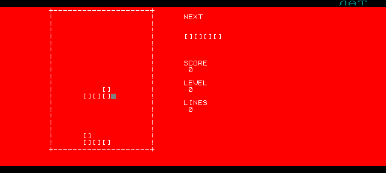

# Немигающий тетрис для УКНЦ на штатном Бейсике

Тетрис для микро-ЭВМ «Электроника МС 0511» (УКНЦ), написанный на её штатном
кассетном Бейсике так, чтобы фигура при движении не мигала: перепечатываются
только те знакоместа, которые действительно изменились. Рядом лежит его
мигающий двойник — та же игра с наивной отрисовкой, для сравнения.

**Игра запускается на настоящем Бейсике**: набирается в эмулятор УКНЦ,
компилируется и играется.



```
src/TETRIS.BAS      игра
src/TETRISC.BAS     мигающий двойник (собирается из первой)
src/KEYTEST.BAS     коды клавиш
src/BENCH.BAS       скорость машины
tools/              стенд без машины, упаковщик, сборка веб-версии
tools/uknc/         безголовый эмулятор УКНЦ: набирает программу и читает экран
web/                страница с Бейсиком в браузере
emulator/           как запустить в браузере, под Linux и под Windows
docs/               язык машины, устройство игры, проверки, ориентир на БК-0010
```

## Три способа поиграть

| Способ | Что нужно | Где написано |
|---|---|---|
| Страница в браузере | ничего | [emulator/README-web.md](emulator/README-web.md) |
| Настоящий эмулятор с готовым состоянием | UKNCBTL | [emulator/README-linux.md](emulator/README-linux.md) |
| Набрать программу в эмулятор самому | UKNCBTL и терпение | там же |

## Проверить, ничего не устанавливая

```sh
python3 tools/test_tetris.py -v     # 35 сценариев на стенде
node tools/test_web.js              # разборщик из веб-страницы
```

Сценарии выполняют настоящий `TETRIS.BAS` на интерпретаторе того же диалекта и
проверяют не картинку, а **какие именно знакоместа игра трогает**: сдвиг
горизонтальной `I` — одно стирание и одна печать, поворот `T` — то же, поворот
`O` — ноль. У мигающего двойника на том же ходу восемь. Подробности —
[docs/TESTING.md](docs/TESTING.md).

## Что выяснилось про машину

Кассетный Вильнюс-Бейсик 1988.09.28 оказался куда строже, чем описание
дискового: **один оператор в строке** (двоеточия нет), **значимы две первые
буквы имени**, четыре пары имён заняты системой, **графики нет вовсе**, а
`COLOR` оставляет за фигурой цветной след, который не стирается. Отсюда и
текстовый тетрис, и двухбуквенные имена, и полное отсутствие цвета.

Всё это не вычитано, а снято опытом на самой машине — вместе с кодами клавиш и
скоростью главного цикла: [docs/UKNC_BASIC_NOTES.md](docs/UKNC_BASIC_NOTES.md).

## Управление

`A` `D` — вбок, `S` — вниз на клетку, `W` — поворот, пробел — мгновенный сброс,
`P` — пауза, `Q` — выход. Работает и раскладка тетриса БК-0010: `7` `9` — вбок,
`8` — поворот, `5` — вниз. Стрелки тоже, они приходят двумя байтами.

## Как это сделано

Устройство игры, повороты, отбой у пола, задержка фиксации —
[docs/IMPLEMENTATION.md](docs/IMPLEMENTATION.md). Состояние по этапам —
[PLAN.md](PLAN.md).
