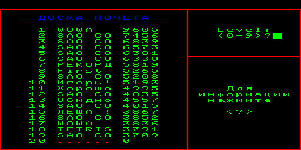
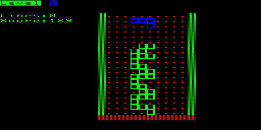
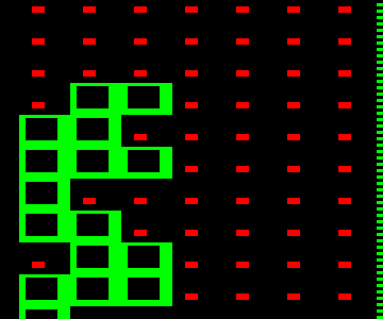

# Тетрис БК-0010: эталон, увиденный своими глазами

Ориентир по ощущениям — «Тетрис» для БК-0010: именно его считали правильным те, кто сидел
за школьными УКНЦ. Раньше эта страница пересказывала сетевые описания. Теперь БК запущен:
собран безголовый эмулятор ([`tools/bk/`](../tools/bk/)) на ядре
[bkbtl-wasm](https://github.com/nzeemin/bkbtl-wasm), игра взята из
[архива pdp-11](https://archive.pdp-11.org.ru/BKGAMES/BIN/) (`Tetris.bin`).

```sh
tools/bk/build.sh
cd build/bk
curl -O https://archive.pdp-11.org.ru/BKGAMES/BIN/Tetris.bin
printf 'frames 200\nloadbin Tetris.bin\nframes 30\nstart 1000\nframes 500\nkey 5\nframes 300\nshot game.ppm\n' | ./bk_run
```

## Что видно



Старт — «ДОСКА ПОЧЁТА» на двадцать строк с именами и очками, запрос `Level: (0-9)?` и
подсказка «Для информации нажмите `<?>`». Уровень выбирается **до** игры, цифрой.



| Что | Как сделано |
|---|---|
| Стакан | нарисован графикой: пустая клетка помечена красной чёрточкой, стены — зелёная штриховка, дно — красная кромка |
| Фигура | **каждая клетка — полый квадрат**: зелёный контур, чёрная середина; соседние клетки сливаются в решётку |
| Активная фигура | другого цвета (синяя), сразу видно, что падает |
| Панель | слева `Level`, `Lines`, `Score` — короткие подписи, без рамок |



🚨 Вот и разгадка «квадрата»: на БК он **нарисован точками**, а не набран знаком. Экран у БК
графический (512×256), игра писана в машинных кодах — ей не нужен знакогенератор. На УКНЦ
такой же квадрат получался иначе: своим начертанием в шрифте, нарисованным редактором
([SCHOOL_UKNC.md](SCHOOL_UKNC.md)).

## Что из этого взято в нашу игру

| Решение | Откуда |
|---|---|
| Уровень выбирается заранее, `0..9` | как на БК (у нас — `SL%`, стартовый уровень) |
| Панель: уровень, строки, счёт | те же три числа |
| Клетка — полый квадрат | тот же образ; в тексте это `O`, а в шрифте с дорисованным знаком — настоящий квадрат |
| Раскладка `7 9 8 5` | наследство «Электроники-60», где Пажитнов писал первую версию на дополнительном цифровом поле |

## Что осталось непроверенным

- Скорость по уровням и таблица очков БК не измерялись: для этого нужно доиграть партию,
  а не снять два кадра.
- Версий тетриса для БК несколько (`Tetris.bin`, `Tetris 2.bin`, `Tetris 3.bin`, `Tetr3.bin`,
  `Tetcolor.bin`, `Tetro.bin` в том же каталоге архива). Запускался первый.
