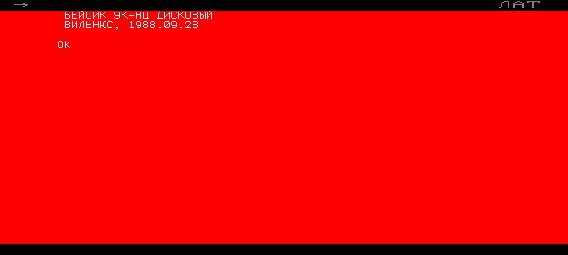
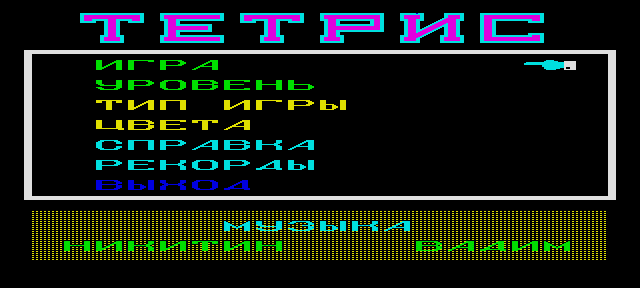
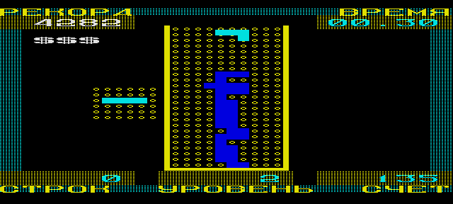
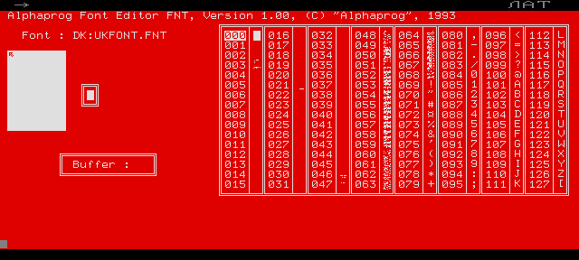

# Школьный УКНЦ: дисковый Бейсик, шрифты и нативные игры

Эта страница появилась из разговора: «в моём УКНЦ был квадрат, а знакогенератор грузился
чем-то вроде POKE». Проверка показала, что память не подвела — просто **машина та же, а
система другая**.

## Что это была за машина

Компьютер, встроенный в клавиатуру, два слота расширения справа, десяток машин в сети,
у головной — дисковод на две пятидюймовки, рядом матричный принтер: это **КУВТ
«Электроника МС 0202»**, класс на базе УКНЦ. Косвенное подтверждение лежало всё это время
на виду: справочник, по которому писалась игра, называется «Программное обеспечение
комплекса вычислительного учебного **Электроника МС 0202**. Бейсик. Описание языка».

## Бейсиков было два, и они разные

| | Кассетный | Дисковый |
|---|---|---|
| Откуда | картридж ПЗУ `romctr_basic.bin` | грузится с дискеты головной машины |
| Как представляется | `БЕЙСИК УК-НЦ КАССЕТНЫЙ` | `БЕЙСИК УК-НЦ ДИСКОВЫЙ` |
| Наша игра писалась под | него | нет |



Школьный класс работал с **дисковым**. Взять его можно из живого архива:

```sh
curl -O https://archive.pdp-11.org.ru/ukdwk_archive/ukncbtlwebcomplekt/dbas_and_games/dbas_games.dsk
build/uknc/uknc_run --disk dbas_games.dsk --script tools/uknc/scripts/boot-disk.txt
```

В загрузочном меню — пункт «1 — диск».

## Что на школьной дискете

Полный список — `rt11dsk l dbas_games.dsk`. Важное:

| Файл | Что это |
|---|---|
| `DBAS.SAV`, `DBAS2.SAV`, `BASIC.SAV`, `NDBAS.SAV` | четыре Бейсика разных лет (1987-1994) |
| **`FNT.SAV`** | загрузчик знакогенератора |
| **`SYSTEM.FNT`, `UKFONT.FNT`** | сами шрифты, по 2560 байт |
| `NEWTET.SAV` | **нативный тетрис** |
| `CAT.GAM`, `COSM.SAV`, `MARS.SAV`, `PIFPAF.GAM`, `POCKER.SAV`, `M3.SAV` | остальные игры не на Бейсике |
| `KLAV.SAV`, `EDIK.SAV`, `HELP.SAV`, `RULON.SAV`, `UST.SAV` | школьная обвязка |

**Загружаемый знакогенератор — не легенда**: на дискете лежит и загрузчик, и два файла
шрифтов. Формат тот же, что у ПЗУ: **11 байт на знак**, но порядок бит в байте обратный.
`UKFONT.FNT` разбирается с базой 394 (знак с кодом N лежит по смещению `394 + N*11`), и
буквы читаются правильно. Квадрата, впрочем, нет и в нём — самые «квадратные» знаки те же
`O`, `C`, `U`.

## Нативный тетрис с той же дискеты

```
.R NEWTET
```





Зеленоград, предприятие «Техно», меню с уровнем, типом игры, цветами, рекордами и музыкой.
Стакан из точек, фигуры цветные — всё то, чего Бейсик не умеет. Это и есть ответ на «под
конец эпохи кто-то раздобыл настоящих игр»: они писались в машинных кодах и рисовали
графикой напрямую.

## Чем меняли знакогенератор: редактор шрифта на той же дискете

`FNT.SAV` — не загрузчик, а **редактор**:

```
.R FNT
FNT> UKFONT
```



`Alphaprog Font Editor FNT, Version 1.00, (C) "Alphaprog", 1993`: слева поле для рисования
знака, справа таблица кодов, внизу буфер. Открывает `.FNT`, правит начертание, сохраняет.

Вот и ответ на «знакогенератор можно было менять»: **не оператором Бейсика, а отдельной
программой**. Ни кассетный, ни дисковый Бейсик такого оператора не знают — `SYMBOL`, `CHAR`,
`FONT`, `DEFCHR`, `PATTERN` и `OUT` во всех вариантах отвечают синтаксической ошибкой,
работают только `POKE`, `PEEK` и `VARPTR`. Шрифт готовился этим редактором и загружался
целиком, до запуска программы.

Отсюда и квадрат, которого нет ни в ПЗУ, ни в двух шрифтах с этой дискеты: его кто-то
нарисовал. Своё начертание в 8×11 точек — работа на пять минут в таком редакторе.

## Что осталось невыясненным

- **Графика в дисковом Бейсике не поднялась.** `SCREEN 2`, `LINE`, `PSET`, `CIRCLE`
  отвечают «Неправильный вызов функции» — при том, что в описании языка МС 0202 они
  есть. Похоже, нужен ещё какой-то шаг: другой Бейсик с дискеты (`BASIC.SAV`, `NDBAS.SAV`,
  `DBAS2.SAV`), драйвер или режим терминала.
- **Как именно `FNT.SAV` грузит шрифт** — не разбиралось. Раз файл шрифта совпадает по
  формату с ПЗУ, а таблица указателей живёт в ОЗУ периферийного процессора
  ([UKNC_BASIC_NOTES.md](UKNC_BASIC_NOTES.md)), механизм ровно тот, что помнит человек:
  свой шрифт кладётся в память ПП, указатели перенастраиваются.
