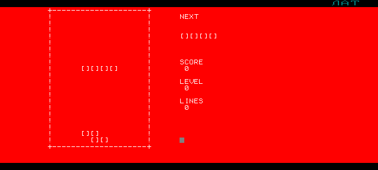
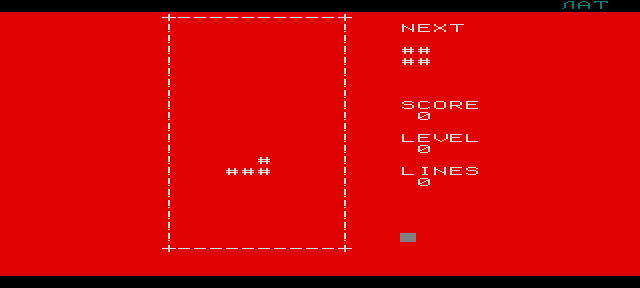

# Как это проверяется

Три слоя, и каждый отвечает на свой вопрос.

| Слой | Вопрос | Команда | Время |
|---|---|---|---|
| Стенд на Python | правильна ли логика и минимальна ли отрисовка | `python3 tools/test_tetris.py` | ~2 мин |
| Стенд веб-версии | не разъехался ли с ней разборщик на JavaScript | `node tools/test_web.js` | секунды |
| Живая машина | запускается ли это на настоящем Бейсике | `tools/uknc/build.sh` и сценарий | ~2 мин |

## Стенд без машины

```sh
python3 tools/test_tetris.py -v          # 35 сценариев с именами
python3 tools/pack_bas.py src/TETRIS.BAS > build/TETRIS.BAS
python3 tools/test_tetris.py build/TETRIS.BAS   # то же на сжатом варианте
```

Проверять картинку бессмысленно: требование проекта не «выглядит правильно», а
**«перепечатывает только изменившиеся клетки»**. Поэтому стенд запоминает каждый
вывод в знакоместо, переводит его обратно в координаты стакана и сверяет с
разницей старого и нового положения фигуры, посчитанной независимо на Python по
таблицам из самой программы. Плюс сверка со счётчиками `DC%` и `EC%` внутри игры.

Стенд не эмулятор: он не знает про такты и видеоконтроллер. Он знает про **язык**
и строг ровно там же, где строга машина, — свойства сняты опытом
([docs/UKNC_BASIC_NOTES.md](UKNC_BASIC_NOTES.md)):

- двоеточие как разделитель операторов — ошибка;
- имя длиннее двух значимых букв — ошибка;
- `RND` без аргумента — ошибка;
- `LOCATE` вне 64×24 — ошибка;
- графических операторов не существует.

### Что покрыто

По требованиям из [AGENTS.md](../AGENTS.md), раздел 12:

| Требование | Сценарий |
|---|---|
| Left/Right в пустом стакане | сдвиг трогает только изменившиеся клетки; горизонтальная I — 1 и 1 |
| падение на одну клетку | падение идёт разницей |
| все переходы ориентаций семи фигур | все переходы; четыре поворота возвращают фигуру на место |
| сбалансированный поворот T | одна клетка стёрта, одна напечатана — на всех четырёх переходах |
| I горизонталь → вертикаль на полу | встаёт и остаётся прижатой к полу |
| I вертикаль → горизонталь | возвращается на пол, а не висит |
| повороты у обеих стен | удаются в пределах стакана либо отменяются без следа |
| невозможный поворот среди блоков | не выполняется и не трогает экран |
| hard drop плюс движение и поворот | окно манёвра остаётся |
| нет бесконечного продления фиксации | продления ограничены `ML%`=12 |
| single/double/triple/tetris | стакан, очки и число линий |
| обновление NEXT | превью меняется только при появлении фигуры |
| game over | новая фигура не помещается |
| рост скорости по уровню | уровень каждые десять строк, задержки убывают |
| нет полного стирания и перерисовки | `CLS` за партию срабатывает дважды, и оба раза до игры |

Сверх списка: раскладка клавиш вместе со стрелками из двух байтов, генератор
фигур, очки, целая случайная партия до game over, разбор `KEYTEST.BAS` и
`BENCH.BAS`, и **сверка мигающего двойника**: `TETRISC.BAS` обязан совпадать с
тем, что делает `tools/make_classic.py`, и обязан трогать восемь клеток там, где
основная версия трогает две.

## Стенд веб-версии

```sh
python3 tools/build_web.py     # собрать страницу из шаблона и обоих исходников
node tools/test_web.js         # прогнать её разборщик
```

В странице живёт вторая реализация того же диалекта — на JavaScript. Она легко
разъезжается с питоновской, поэтому прогоняется тем же набором: таблицы фигур,
разница отрисовки, поворот T, отбой I у пола, восемь клеток у мигающей версии,
целая партия и запрет двоеточия.

## Живая машина

```sh
tools/uknc/build.sh
cd build/uknc
python3 ../../tools/pack_bas.py ../../src/TETRIS.BAS > T.BAS
./uknc_run --cart romctr_basic.bin --script run3.txt
python3 ../../tools/uknc/screen_text.py t3.ppm
```

Устройство сборки — [tools/uknc/README.md](../tools/uknc/README.md).

| Проверка | Кассетный Бейсик из картриджа | Дисковый Бейсик |
|---|---|---|
| БЕЙСИК стартует | ✅ `ВИЛЬНЮС, 1988.09.28` | образа нет |
| игра набирается и компилируется | ✅ 573 строки | — |
| заставка и старт | ✅  | — |
| стакан, панель, превью | ✅  | — |
| движение и поворот с клавиатуры | ✅ | — |
| мгновенный сброс и очки | ✅ счёт вырос на 8 за 4 клетки | — |
| фиксация и следующая фигура | ✅ | — |
| нет следов от стирания | ✅ после отказа от `COLOR` | — |
| мигающая версия | ✅  | — |
| скорость падения | ✅ 24 кадра на клетку при уровне 0 | — |
| управление стрелками | ✅ влево-вправо, вверх — поворот, вниз — сброс | — |
| широкий формат 40×24 | ✅ клетка в один знак, `CW%=1`  | — |
| системное меню машины (УСТ) | ✅ формат экрана и цвета переключаются поверх Бейсика | — |
| удаление строк вживую | не доигрывали | — |
| максимальный уровень | не доигрывали | — |

Две последние строки требуют не автомата, а человека с клавиатурой: сыграть
достаточно долго, чтобы собрать линии. Стенд их проверяет, машина — пока нет.
