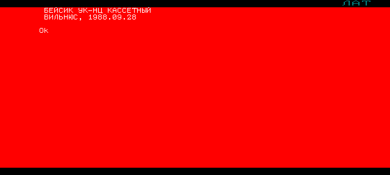
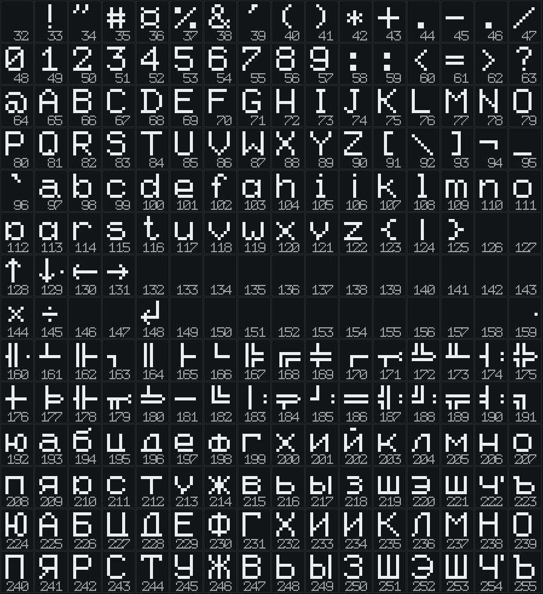
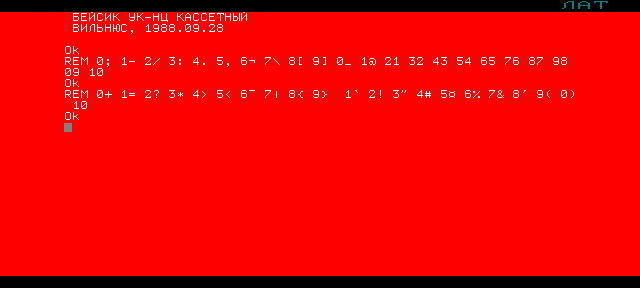

# Кассетный Бейсик УКНЦ: что выяснилось на самой машине

Всё ниже **проверено опытом** на настоящем Вильнюс-Бейсике из картриджа ПЗУ,
запущенном в эмуляторе УКНЦ без окна (`tools/uknc/`). Не «по документации» —
документация описывает *дисковый* Бейсик 1985.11.01, а картридж отвечает так:



```
БЕЙСИК УК-НЦ КАССЕТНЫЙ
ВИЛЬНЮС, 1988.09.28
Ok
```

Это две разные системы, и различия принципиальные. Что подтвердилось у
дискового варианта по [описанию языка](https://emuverse.ru/wiki/УКНЦ_Бейсик_Описание_языка),
у кассетного часто не работает вовсе.

## 🚨 Четыре правила, из которых выросла вся программа

### 1. Один оператор в строке

Двоеточия как разделителя **нет**: `A=1 : B=2` — Ошибка 2. `\`, `!`, `&` тоже
не работают (Ошибки 11 и 2). Поэтому в `TETRIS.BAS` шестьсот строк по одному
оператору, а стенд `tools/uknc_basic.py` отвергает двоеточие так же, как машина.

### 2. Значимы две первые буквы имени, и четыре пары заняты системой

`SCORE` и `SCREEN` для машины — одно и то же имя. Хуже: **бесcуффиксные**
двухбуквенные имена сталкиваются со служебными словами. Проверены все имена
программы (`build/uknc/n*.ppm`), отказали четыре:

| Имя | Что отвечает | Заменено на |
|---|---|---|
| `SC=1` | Ошибка 24 | `SR` (счёт) |
| `SY%(1,1)=5` | Ошибка 2 — причём **чтение работает, запись нет** | `TY%` |
| `LP%=1` | Ошибка 2 | `LT%` |
| `PO=0` | Ошибка 24 | `SR` |
| `FO$=CHR$(186)` | Ошибка 2 — `FO` начинает `FOR` | знак печатается `CHR$` на месте |
| `BL$=CHR$(166)` | Ошибка 13 | то же |

Суффикс `%` или `$` от столкновения не спасает: `SY%`, `LP%` и `FO$` отказали вместе с
бессуффиксными. Похоже, система занимает пары, с которых начинаются её собственные слова
(`FO` — `FOR`, `SC` — `SCREEN`, `PO` — `POKE`), но правило целиком вывести не удалось:
`BL$` отвечает вообще другой ошибкой. Поэтому **каждое имя проверяется на машине**, в шапке
исходника лежит словарь, а в `build/uknc/` — снимки проверки. Там, где имя не нужно, знак
печатается прямо `CHR$` — так нарисован стакан.

### 3. Графики нет

`LINE @(300,10)-@(400,60),7,BF`, `LINE (300,70)-(400,120),7,BF`, `PSET @(500,20)`
— все отвечают **Ошибкой 5**, и до, и после `SCREEN 3`. Ошибка не синтаксическая,
то есть операторы системе известны, но в кассетном варианте не реализованы.
Отсюда текстовый тетрис: клетка стакана — два знакоместа `[]`.

### 4. `COLOR` красить нельзя

Оператор принимается, но ведёт себя не так, как ждёшь:

- `COLOR 2` (один аргумент) — следующий вывод превращается в **сплошной
  цветной прямоугольник**: текст не читается;
- `COLOR 4,0` (два аргумента) — фон становится чёрным, но цвет самого текста
  не меняется;
- 🚨 главное: после любого `COLOR` знакоместо, куда что-то напечатали,
  **сохраняет цветной блок, который печать пробелов не убирает**. Падающая
  фигура оставляет за собой сплошную полосу.

Поэтому игра не трогает `COLOR` вообще и живёт в тех цветах, которые выставлены в машине.
По умолчанию это белым по красному, но красный тут не свойство УКНЦ, а настройка: цвет
экрана выбирается в системном меню (см. ниже), а на домашних чёрно-белых мониторах он и
вовсе был просто светлым фоном.

## Что работает и как

| Что | Как | Проверено |
|---|---|---|
| Экран | текстовый; Бейсику доступны 64 столбца (0..63) и 24 строки (0..23) | `LOCATE 64,0` и `LOCATE 0,24` дают Ошибку 5 |
| Ширина строки | `WIDTH 32` сужает её до 32 столбцов, знаки при этом остаются узкими | `LOCATE 32,0` после этого — Ошибка 5 |
| Курсор | `LOCATE <столбец>,<строка>`, отсчёт от нуля | напечатали рамку по углам |
| Печать | `PRINT`, точка с запятой держит курсор в строке | вся отрисовка игры |
| Строки | `STRING$(20,"-")` — есть | рамка стакана |
| Клавиатура | `INKEY$` не блокирует, `ASC` даёт код КОИ-7 | главный цикл |
| Массивы | двумерные целые `DIM BD%(9,19)` — есть | стакан |
| Ветвление | `IF <усл> THEN <оператор>` и `IF <усл> THEN <номер строки>` | везде |
| Подпрограммы | `GOSUB` / `RETURN` | везде |
| Данные | `READ` / `DATA` | таблицы фигур |
| `ON` | `ON X GOTO 100,200` работает | проверено отдельно |
| Случайное | **`RND(1)`, с аргументом**: `RND` без скобок — Ошибка 2 | генератор фигур |
| Часов нет | `TIME` — просто необъявленная переменная, всегда 0 | время считаем витками цикла |
| `RANDOMIZE` | Ошибка 2, нет такого | засев — счётчиком ожидания клавиши |
| `DEF FN` | Ошибка 12 | не используется |
| Компиляция | программа компилируется целиком перед пуском: ошибка в 306-й строке видна сразу, ничего до неё не выполняется | ловили `SC=0` |

## Все знаки машины

Таблица снята с ПЗУ: программа напечатала подряд коды 32..255, снимок разобран по
знакоместам. Это **весь** набор — ничего другого машина нарисовать не умеет.



| Диапазон | Что там |
|---|---|
| 32-127 | латиница и знаки препинания; 36 — `¤` (это байт `$`), 94 — `¬` |
| 128-131 | стрелки ↑ ↓ ← → |
| 132-159 | почти всё пусто; 144 `×`, 145 `÷`, 148 `↵` |
| 160-191 | псевдографика: одинарные и двойные линии, углы, тройники, кресты |
| 192-255 | кириллица: 192-223 строчные, 224-255 прописные |

🚨 **Сплошного или полого квадрата в наборе нет.** Перебор всех 224 начертаний по признаку
«рамка есть, середина пуста» не нашёл ничего; вся псевдографика — линии через середину
знакоместа. Самый «квадратный» знак — латинская `O` (79): в этом шрифте она нарисована
полым прямоугольником 6×8.

## Знакогенератор: менять начертание из этого Бейсика нечем

Что проверено на машине:

- операторов нет: `SYMBOL`, `CHAR`, `FONT`, `DEFCHR`, `PATTERN`, `SHAPE` — все Ошибка 2;
- `OUT` тоже нет (Ошибка 2), а `POKE` и `PEEK` есть и работают;
- `VARPTR` есть.

Чего найти не удалось: самой таблицы знакогенератора. Начертания искались в ПЗУ машины и
во всех четырёх планах ОЗУ шестнадцатью способами (по строкам и по столбцам, прямой и
обратный порядок бит, прямой и обратный порядок строк, с инверсией) — совпадений нет.
Значит, шрифт лежит не открытым массивом: либо упакован, либо живёт в памяти
периферийного процессора, до которой `POKE` центрального не дотягивается.

Загружаемый знакогенератор у УКНЦ был — это помнят все, кто на ней работал, — но
управляющая последовательность, которой он загружается, в доступных нам источниках не
нашлась (её место — «Техническое описание МС 0511» и описание драйвера терминала ПП).
**Знаете последовательность — проверка займёт пять минут**: `PRINT CHR$(27);...` в сценарии
безголовой сборки и снимок экрана.

## Системное меню машины: клавиша УСТ

Клавиша **УСТ** (код УКНЦ 0152) открывает «УСТАНОВКА РЕЖИМОВ» поверх любой программы. Меню
работает и в эмуляторе, и поверх Бейсика:

```
1 - система команд      5 - цвет экрана
2 - формат экрана       6 - цвет курсора
3 - цвет символа        7 - рулон
4 - цвет знакоместа     8 - таймер
```

Чем нажимать:

| Где | Как |
|---|---|
| UKNCBTL (родная сборка) | **F7** или **End** — обе клавиши дают код 0152 (`arrPcscan2UkncscanLat`) |
| браузерная сборка ukncbtl-online | F-клавиши и End там не назначены: жать УСТ на **картинке клавиатуры** под экраном |
| наша безголовая сборка | `key UST` в сценарии (или `raw 152 0`) |
| наша веб-страница | меню нет вовсе: это разборщик Бейсика, а не машина. Формат экрана переключается тумблером на панели |

Соседние служебные клавиши той же строки: **F6** — ПОМ, **F8** — ИСП, **F9** — СБРОС,
**F11** — СТОП, **F1..F5** — К1..К5.

Ходить по меню так: цифра выбирает строку, **вправо** входит в подменю, **вверх-вниз**
двигают, **ввод** применяет, **УСТ** закрывает.

### Формат экрана: те самые «широкие буквы»

Подменю даёт **80×24, 40×24, 20×24, 10×24**. Машина включается в 80×24, и знак занимает
8 точек по горизонтали. В 40×24 знак становится вдвое шире — это и есть «широкие буквы», в
которых одна клетка тетриса умещается в **один** знак вместо двух.

🚨 Бейсик про это не знает: `LOCATE` у него всё равно ограничен 63-м столбцом, а
`WIDTH 32` меняет только его собственную ширину строки (текст встаёт в 32 колонки, но знаки
остаются узкими). Формат экрана переключается **только меню**, из программы — никак.

Поэтому в игре ширина клетки — настройка `CW%` (строка 105): `CW%=2` для обычного экрана,
`CW%=1` для широкого. Всё остальное считается от неё.

### Цвета — тоже настройка машины, а не программы

«Цвет экрана», «цвет знакоместа» и «цвет символа» выбираются из восьми: чёрный, красный,
зелёный, жёлтый, синий, фиолетовый, голубой, белый. Эмулятор включается с **красным** экраном
и красным знакоместом — отсюда красные снимки. На чёрно-белом мониторе, каким его видели
дома, это просто серый фон.

Отсюда же вывод про оператор `COLOR`: он трогает те же настройки, и рассогласование цвета
знакоместа с цветом экрана оставляет за фигурой цветную полосу. Игра не трогает ни то, ни
другое — и одинаково выглядит при любой настройке машины.

## Коды клавиш

Снято программой, печатающей `ASC(INKEY$)`:

| Клавиша | Код |
|---|---|
| `A` `D` `S` `W` `P` `Q` | 65, 68, 83, 87, 80, 81 (строчные +32) |
| пробел | 32 |
| `7` `9` `8` `5` (раскладка БК) | 55, 57, 56, 53 |
| стрелки | **два байта**: 27, затем 65 (вверх), 66 (вниз), 67 (вправо), 68 (влево) |

Стрелки — штатное управление игры: влево-вправо двигают, вверх поворачивает, вниз сбрасывает
фигуру целиком. Разбираются они отдельно (строка 1060 в `TETRIS.BAS`): первый байт
запоминается, действие выбирается по второму.

Раскладка самой клавиатуры УКНЦ с раскладкой PC **не совпадает**: `:` и `*`
сидят на одной клавише, `"` — это Shift+2, а `$` (на экране `¤`) — Shift+4.
Таблица снята опытом и лежит в `tools/uknc/headless.cpp`:



## Скорость

Замеры на штатной скорости эмуляции (25 кадров = 1 секунда машинного времени):

| Что | Время | В секунду |
|---|---|---|
| 10000 пустых витков `FOR` | 7,84 с | ~1280 |
| 10000 чтений из двумерного массива | 11,76 с | ~850 |
| 500 раз `LOCATE` плюс `PRINT` двух знаков | 1,32 с | ~380 |
| холостой виток главного цикла игры | — | **~350** |

Отсюда таблицы задержек в `TETRIS.BAS` (строки 10204-10208): на нулевом уровне
фигура падает на клетку за секунду, что проверено обратным замером — 24 кадра
между шагами гравитации.

## Как это проверялось

```sh
tools/uknc/build.sh                      # собрать безголовый УКНЦ
build/uknc/uknc_run --cart romctr_basic.bin --script сценарий.txt
python3 tools/uknc/screen_text.py снимок.ppm   # прочитать экран как текст
```

Картридж `romctr_basic.bin` берётся из релиза UKNCBTL 2023.1, ПЗУ машины —
из исходников эмулятора. Подробности — [tools/uknc/README.md](../tools/uknc/README.md).

## Чего мы так и не знаем

- Как ведёт себя **дисковый** Бейсик 1985.11.01 — образа с ним у нас нет.
  Игра написана так, чтобы шансы были: ни одной конструкции, которой нет в
  описании языка. Но проверить это нечем.
- Настоящая машина — только эмулятор. На живом УКНЦ никто не запускал.
